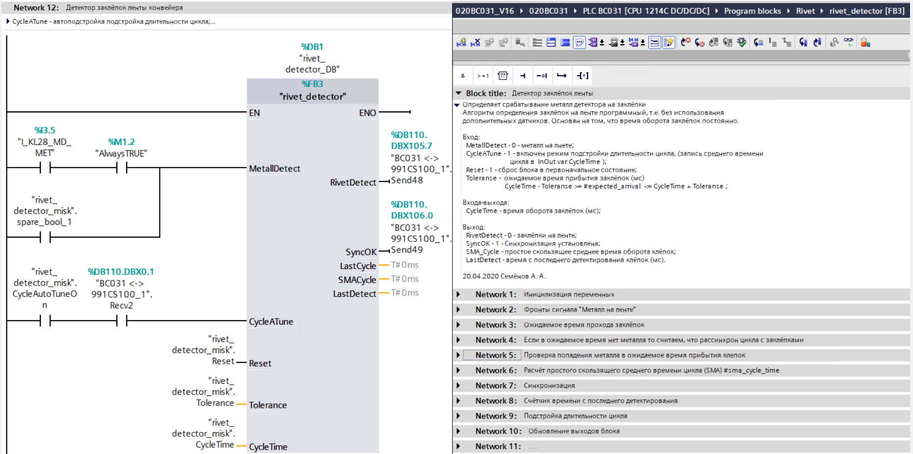

# Детектор заклёпок для конвейерной ленты

Специализированная система обнаружения заклёпок на конвейерной ленте, разработанная для ПЛК Siemens S7-1500 в среде TIA Portal.

## Обзор

Этот проект реализует программное решение для обнаружения заклёпок на конвейерной ленте с использованием металлодетектора. Система разработана для работы с ПЛК Siemens S7-1500 и программируется в среде TIA Portal.

## Файлы проекта

Проект состоит из глобальной библиотеки TIA Portal:
- `TIA16 GLIB Rivet_detector.zip` - Глобальная библиотека для TIA Portal v16,  функциональный блок FB3 "rivet_detector" алгоритма обнаружения заклёпок

## Принцип работы

Алгоритм обнаружения основан на принципе постоянного времени оборота заклёпок на ленте. Система идентифицирует заклёпки, анализируя паттерн срабатывания металлодетектора.

### Процесс синхронизации

Для правильной синхронизации алгоритма с заклёпками:
1. Лента должна совершить 3 полных оборота относительно металлодетектора
2. В течение этих оборотов металлодетектор должен срабатывать только на заклёпки
3. В процессе синхронизации не должно быть обнаружено других металлических предметов

## Технические детали

- **Аппаратное обеспечение**: ПЛК Siemens S7-1500
- **Среда разработки**: TIA Portal V16
- **Метод обнаружения**: Программный алгоритм
- **Требования к синхронизации**: 3 полных оборота ленты

